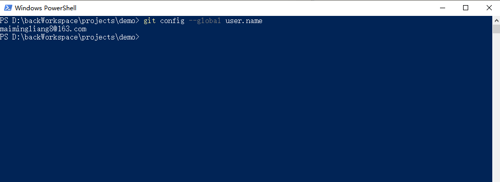
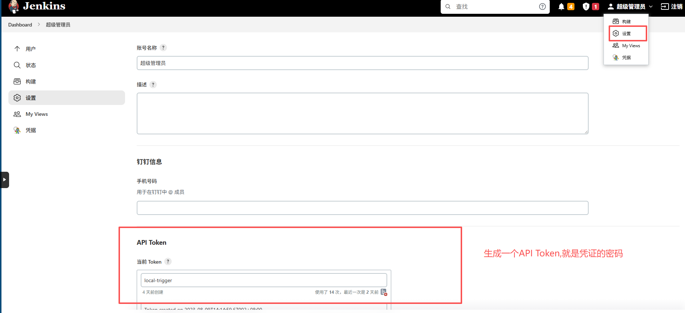
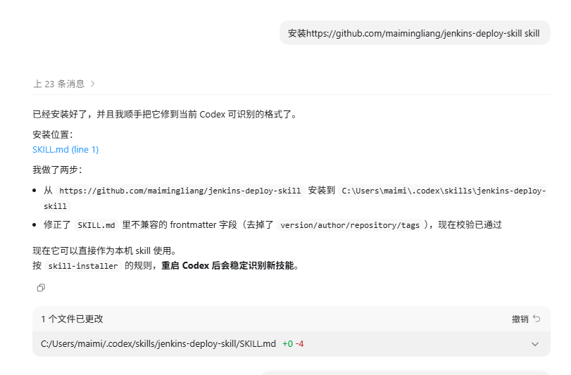
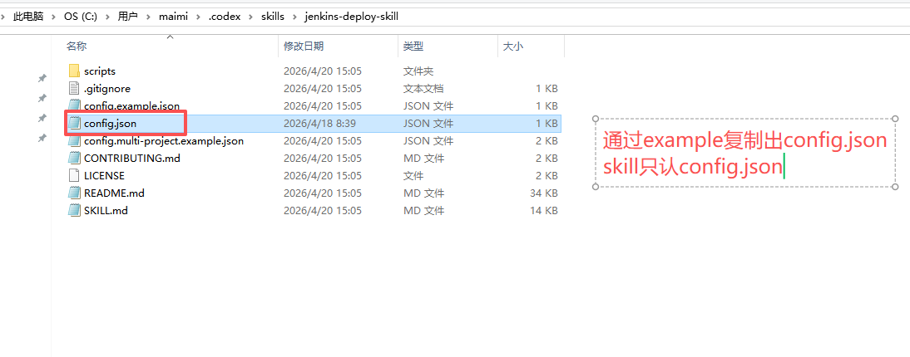
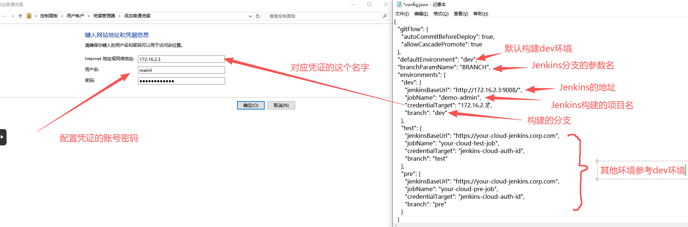
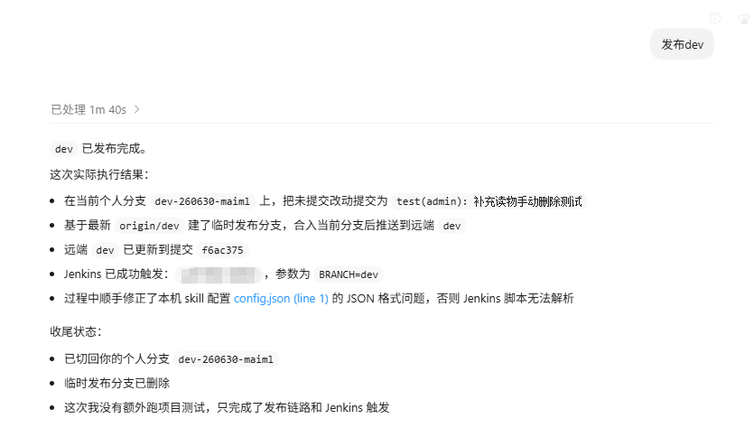

# jenkins-deploy-skill 图文上手指南 (Visual Guide)

本指南通过截图展示了从环境准备到成功发布的完整流程。

---

## 1. 环境准备 (Environment Check)

在开始之前，确保你的 Git 全局配置已经正确设置（特别是用户名和邮箱），因为 Skill 会基于这些信息进行代码提交。

---

## 2. Jenkins 凭据准备 (Jenkins API Token)

你需要生成一个 Jenkins API Token 作为身份验证密钥。

1. 登录 Jenkins，点击右上角用户名 -> **设置 (Settings)**。
2. 找到 **API Token** 模块，点击 **生成 (Generate)**。
3. **记录下这个 Token**，它将作为后续存储在系统凭据管理器中的“密码”。

---

## 3. Skill 安装 (Installation)

如果你使用的是支持 URL 安装的 AI 助手（如 Codex、Claude Code），可以直接发送安装链接。

指令示例：
`安装 https://github.com/maimingliang/jenkins-deploy-skill skill`

---

## 4. 配置文件初始化 (Configuration)

### 4.1 创建 config.json
将项目根目录下的 `config.example.json` 复制并重命名为 `config.json`。
> [!IMPORTANT]
> Skill 运行时优先读取并只认 `config.json`。

### 4.2 映射系统凭据 (Credential Mapping)
这是最关键的一步。你需要将 `config.json` 中的 `credentialTarget` 字段与系统凭据管理器中的“网络地址”进行对应。

*   **左图**：在 Windows 凭据管理器中添加“普通凭据”。
*   **右图**：在 `config.json` 中配置对应的环境参数。

---

## 5. 实际发布演练 (Usage Example)

配置完成后，你可以尝试对 AI 助手说：`发布dev`。

AI 会自动完成以下操作：
1. **自动 Fetch** 远端代码。
2. 在本地创建名为 `tmp-deploy/...` 的**隔离分支**。
3. 如果有未提交改动，自动执行一次**受控提交**。
4. **Push** 到远端发布分支。
5. **触发 Jenkins** 任务。

---

## 更多参考
*   详细的参数说明请查看 [README.md](./README.md)。
*   规范定义请查看 [SKILL.md](./SKILL.md)。
